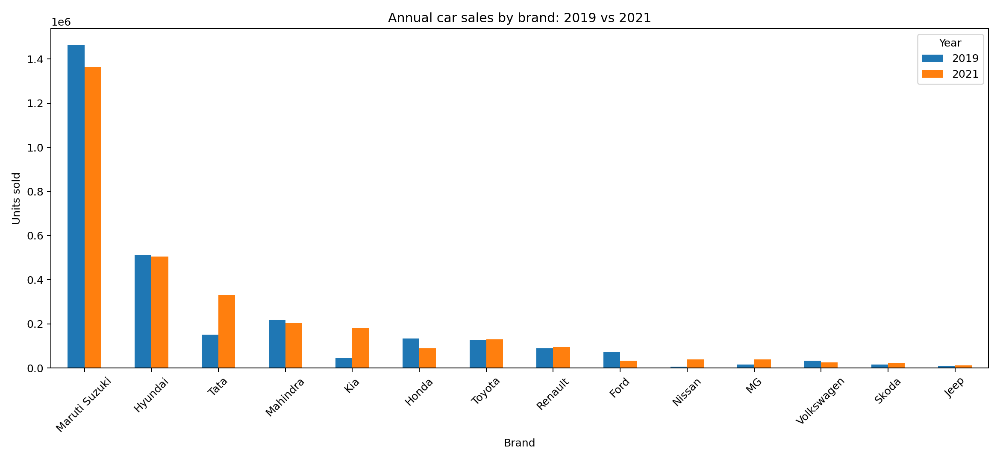
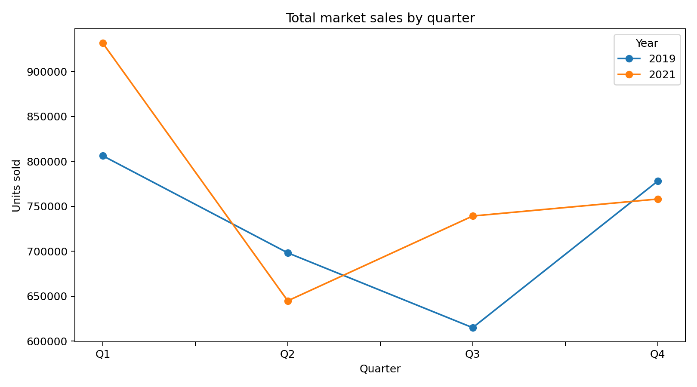

# Indian Car Sales Analysis: 2019 vs 2021

A statistical analysis of monthly and quarterly passenger-car sales in India, comparing **2019** with **2021** across 14 automobile brands.

This project began as an undergraduate Statistics project and has been reorganized here as a reproducible portfolio project. The analysis covers data preparation, quarterly aggregation, exploratory visualization, Pearson chi-square tests, and two-way ANOVA without replication.

## Project question

How did the distribution and seasonal pattern of car sales across major brands differ between 2019 and 2021?

> Note: 2019 is used as the pre-pandemic baseline. Because COVID-19 was still affecting India during 2021, this repository describes 2021 as a **pandemic/recovery-period comparison year**, rather than treating it as a fully post-pandemic year.

## Data source

Original dataset: **Car Sales in India (2019-2021)** on Kaggle  
https://www.kaggle.com/datasets/subhadeeptasahoo/car-sales-in-india-20192021

The source file contains 2019, 2020 and 2021 monthly sales. This project intentionally filters the data to **2019 and 2021**. The raw Kaggle file is not redistributed in this repository because its license could not be verified while preparing the public version; see `data/raw/README.md`.

## Data preparation

For each brand:

- Monthly sales for 2019 and 2021 are retained.
- Quarterly totals are calculated directly from the source months:
  - Q1 = Jan + Feb + Mar
  - Q2 = Apr + May + Jun
  - Q3 = Jul + Aug + Sep
  - Q4 = Oct + Nov + Dec
- Annual totals are calculated as the sum of all 12 months.
- Source-data zeros are preserved exactly; they are **not replaced by 1**.

## Repository structure

```text
indian-car-sales-analysis/
├── README.md
├── R/
│   ├── original_report_code.R
│   ├── 01_prepare_data.R
│   ├── 02_statistical_analysis.R
│   └── 03_visualization.R
├── report/
│   ├── original_academic_report.pdf
│   └── README.md
├── data/
│   ├── raw/
│   │   └── README.md
│   └── processed/
│       ├── monthly_sales_2019_2021.csv
│       ├── quarterly_sales_2019_2021.csv
│       ├── yearly_sales_2019_2021.csv
│       └── market_totals.csv
└── figures/
    ├── annual_sales_by_brand.png
    └── quarterly_market_sales.png
```

## Original academic submission

The repository includes the **original academic report** in `report/original_academic_report.pdf` and a transcribed/repository-friendly version of the R code shown in its appendix in `R/original_report_code.R`. These files preserve the project as it was originally presented and support the project description used on the resume.

The original report is kept unchanged. A later reproducibility check found some manual/transcription differences between the report tables and the supplied Kaggle CSV; these are documented transparently in `docs/data_quality_notes.md`. The cleaned scripts regenerate the derived data directly from the source values.

## Key results

### Overall market total

Across the 14 brands in the dataset, total recorded sales were:

| Year | Total units |
|---|---:|
| 2019 | 2,897,215 |
| 2021 | 3,073,588 |

This is an increase of approximately **6.1%** in the combined total for these brands. Therefore, the data do **not** support a blanket statement that total sales across the selected brands were lower in 2021. The changes were strongly brand-specific.



Examples of large brand-level changes between 2019 and 2021 include strong increases for Tata, Kia, MG and Nissan, while Ford and Honda recorded substantial declines.

### Pearson chi-square tests

Using the source values directly:

| Test | Chi-square | df | Result |
|---|---:|---:|---|
| Brand x Year (annual counts) | 205,684.50 | 13 | p < 0.001 |
| Brand x Quarter, 2019 | 105,473.74 | 39 | p < 0.001 |
| Brand x Quarter, 2021 | 53,411.02 | 39 | p < 0.001 |

These tests show strong association between the distribution of recorded sales and brand/year or brand/quarter. Because the observations are aggregate sales counts, the tests should be interpreted as descriptive association rather than a causal estimate of the pandemic's effect.

### Two-way ANOVA without replication

The quarterly totals were analyzed using brand and quarter as factors.

| Year | Brand effect | Quarter effect |
|---|---|---|
| 2019 | F = 189.02, p < 0.001 | F = 2.70, p = 0.0588 |
| 2021 | F = 105.69, p < 0.001 | F = 3.37, p = 0.0280 |

Brand-to-brand differences are highly significant in both years. Quarter-to-quarter variation is not significant at the 5% level in 2019, but it is significant in 2021.



## Reproducibility

The analysis uses base R.

1. Download the original Kaggle CSV.
2. Save it as `data/raw/car_sales_india_2019_2021.csv`.
3. Run:

```r
source("R/01_prepare_data.R")
source("R/02_statistical_analysis.R")
source("R/03_visualization.R")
```

The first script recreates all processed monthly, quarterly and annual tables from the original monthly data.

## Methodological notes

- The original source data contain some genuine zero-sales months for newer/exiting brands. These are kept as zero in the cleaned analysis.
- The two-way ANOVA uses one aggregated observation per Brand x Quarter cell. Therefore, a separate interaction effect cannot be estimated in this design.
- The project compares two calendar years and does not by itself establish that COVID-19 caused every observed change. Brand launches, exits, supply constraints and other market factors may also contribute.

## Tools

- R
- Statistical data analysis
- Data cleaning and aggregation
- Pearson chi-square test
- Two-way ANOVA
- Data visualization
